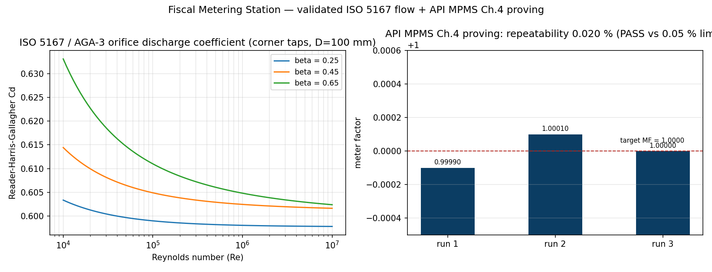

# Fiscal Metering Station

A standards-oriented toolkit for **fiscal / custody-transfer flow measurement**:
orifice-plate and Coriolis flow computation, API MPMS Chapter 4 meter proving, GUM
uncertainty analysis, and tamper-evident custody transfer tickets.

Built from the ground up (no metering libraries) so every number is traceable to a
published standard or formula.



## Why this exists

Fiscal meters sit at the cash register of oil & gas, water, and chemical transfer
agreements — the measured quantity *is* the billed quantity. The discipline that keeps
them honest is the one this project exercises end to end:

1. **Compute** the flow from the meter signal (ISO 5167 / AGA-3 orifice, Coriolis).
2. **Prove** the meter against a reference volume (API MPMS Ch.4 meter factor + repeatability).
3. **Quantify** the uncertainty (GUM, Type A + Type B, expanded at k = 2).
4. **Issue** a tamper-evident ticket with an integrity hash (SHA-256).

## Highlights

- **`dashboard.html`** — fully self-contained interactive web app (no libraries, no
  build step): tune pipe/bore/dP/fluid on an orifice run or raw Coriolis signals and
  watch flow, discharge coefficient, expansibility, proving runs, the GUM budget and a
  custody ticket recompute live. Open it directly in a browser.
- **ISO 5167:2003 orifice flow** with the **Reader-Harris-Gallagher** discharge
  coefficient (corner / flange / D–D/2 taps) and ISO 5167-2 expansibility, iterated to
  convergence on Reynolds number.
- **Coriolis** mass flow + density-from-frequency model.
- **API MPMS Ch.4 proving**: per-run meter factor, average MF, repeatability check
  against the proving limit (default 0.05 %), prover thermal correction.
- **GUM budget**: proving repeatability (Type A) combined with Type B instrument
  contributions (normal / rectangular), RSS, expanded uncertainty at k = 2.
- **Tamper-evident custody ticket**: every field folded into a SHA-256 hash — any
  post-issue edit fails verification (same data-integrity discipline regulated GMP
  environments demand).
- **33 unit tests** pin the numbers against published values (RHG band, gas
  compressibility, repeatability pass/fail, uncertainty RSS, tamper detection).

## Layout

```
flowlib/            # the metering math (importable package)
  orifice.py        # ISO 5167 / AGA-3: RHG Cd, expansibility, iterative mass flow
  coriolis.py       # Coriolis mass flow, density from tube frequency
  compensation.py   # base-condition volume correction (simplified API 11.1)
  proving.py        # API MPMS Ch.4 meter proving (MF, repeatability, prover CTE)
  uncertainty.py    # GUM budget (Type A + B, k=2)
  ticket.py         # custody ticket + SHA-256 integrity hash
  fluids.py         # liquid density model + Redlich-Kwong gas compressibility
dashboard.html      # self-contained interactive demo (generated)
scripts/            # builders
tests/              # pytest suite (33 tests)
examples/           # end-to-end CLI demo
```

## Quick start

```bash
python -m pytest            # 33 tests, validates every number
python examples/example_run.py
```

Open `dashboard.html` in any browser for the interactive station.

## Engineering notes

### Orifice metering (ISO 5167:2003 / AGA-3)

Mass flow through a square-edged orifice plate:

    qm = C / sqrt(1 - beta^4) * epsilon * (pi/4) d^2 * sqrt(2 dP rho)

where `C` is the Reader-Harris-Gallagher discharge coefficient, `beta = d/D`, and
`epsilon` is the ISO 5167-2 expansibility factor (1.0 for liquids). Because `C` depends
on the Reynolds number (which depends on flow), the solution is iterated to convergence.
Validity: `0.1 <= beta <= 0.75`, `P2/P1 >= 0.75`.

### Meter proving (API MPMS Ch.4)

A prover delivers a known reference volume; the meter factor corrects the meter's
indicated volume to the true volume:

    MF = Vprover / Vindicated
    MF = mean of valid runs

Repeatability `(max - min)/mean` must stay within the proving limit (classically
0.05 % for a three-run prove) — flagged PASS/FAIL. The prover volume is corrected for
steel thermal expansion from its calibration temperature.

### Uncertainty (GUM)

    Type A:  run-to-run scatter of the proving: u = s / sqrt(n)
    Type B:  instrument accuracies, normal (u = nominal/2) or rectangular (u = nominal/sqrt(3))
    Combined: uc = sqrt( sum (ci * ui)^2 )        (RSS)
    Expanded: U = k * uc,  k = 2  (~95 % confidence)

### Fluids

Liquids use a linearised density model (simplified API MPMS Ch.11.1 form); gases use
the Redlich-Kwong (1949) equation of state as a documented stand-in for the full
AGA-8 / API MPMS Ch.14.2 detail that production fiscal gas meters run.

## Standards map

| Standard | Used for |
|---|---|
| ISO 5167:2003 (AGA-3) | Orifice discharge coefficient, mass flow |
| ISO 5167-2 | Expansibility factor |
| API MPMS Ch.4 | Meter proving, meter factor, repeatability |
| API MPMS Ch.11.1 | Volume compensation to base conditions (simplified) |
| GUM (ISO/IEC Guide 98) | Uncertainty budget, expanded uncertainty |
| ISO 4064 / OIML R49 / OIML R117 | Water & liquid legal metrology (context) |
| ISO 17025 | Calibration-laboratory traceability context |
| EAC (EAS) / UNBS | East Africa & Uganda legal metrology context |
